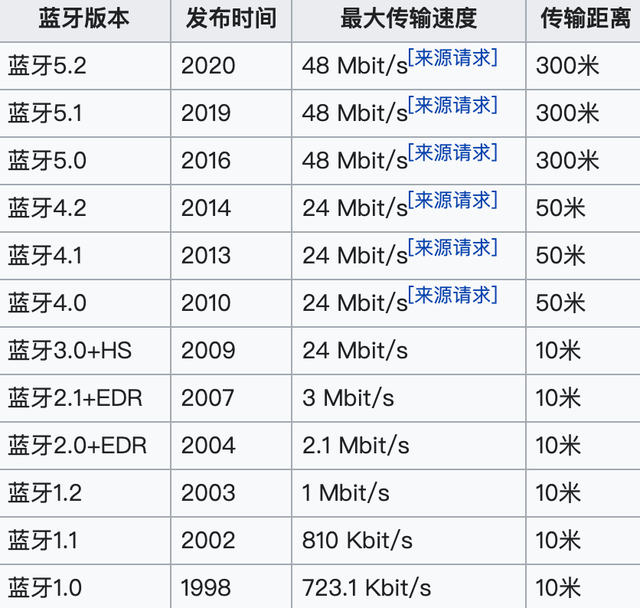

# 经典蓝牙和 LE(低功耗)蓝牙的区别

## 一、蓝牙技术发展简史：

[蓝牙技术的官方组织](https://www.bluetooth.com/zh-cn/)是蓝牙技术联盟（Bluetooth special interest group，简称Bluetooth SIG），目前蓝牙协议已经发展到了蓝牙5.4（2023）。

 

## 二、蓝牙技术同其他技术的比较以及优势：

## 三、Android 中的蓝牙

> 现在的蓝牙分为三类：**经典蓝牙**、**低功耗蓝牙(BLE)**和**双模蓝牙**。

### 1. 经典蓝牙和 LE(低功耗)蓝牙的区别

#### 1.1. 协议版本

* **经典蓝牙**：支持不同版本的规范，如Bluetooth 2.0、Bluetooth 3.0、Bluetooth 4.0、Bluetooth 5.0等。
* **低功耗蓝牙（BLE）**：支持不同版本的规范，如Bluetooth 4.0、Bluetooth 4.1、Bluetooth 4.2、Bluetooth 5.0、Bluetooth 5.1和Bluetooth 5.2。每个版本都引入了新的功能和改进，如安全性增强、速度提升、广播范围增加等。

#### 1.2. 数据传输速度

* **经典蓝牙**：支持更高的数据传输速度，适用于需要传输大量数据的应用。
* **低功耗蓝牙（BLE）**：传输速度较低，适用于小型数据包的周期性传输。

#### 1.3. 功耗

* **经典蓝牙**：通常功耗较高，不适合长时间的低功耗操作，因此不适用于电池寿命要求较高的设备。
* **低功耗蓝牙（BLE）**：设计用于低功耗操作，能够在较长时间内维持连接，适用于电池供电设备。

#### 1.4. 连接方式

* **经典蓝牙**：使用较复杂的连接过程，需要建立连接并保持连接。
* **低功耗蓝牙（BLE）**：支持快速连接和断开，以节省能量。

#### 1.5. 应用和用途

* **经典蓝牙**：用于在较短距离内（通常不超过10米）进行高速数据传输，如音频传输（例如耳机、音响系统）、 文件传输、键盘和鼠标连接等。
* **低功耗蓝牙（BLE）**：主要用于低功耗应用，如传感器、健康和医疗设备、物联网（IoT）设备等，它通常在较长时间内维持连接并以最低功耗传输小量数据。

