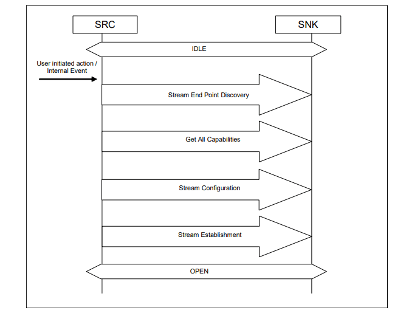

# 手机与蓝牙耳机、音箱配对

### 一、概述

从 Android 3.0 开始，Bluetooth API 支持蓝牙配置文件，蓝牙配置文件是适用于设备间蓝牙通信的无线接口规范。大家平常使用蓝牙耳机，蓝牙音箱所通过蓝牙声卡播放出来的音乐就是走的A2DP协议实现的，此协议有时被称为媒体音频协议。

#### 1. [**A2DP**](https://www.bluetooth.com/zh-cn/specifications/specs/advanced-audio-distribution-profile-1-4/)

Advance Audio Distribution Profile，高级音频分配配置文件的缩写。高级音频分发配置文件(A2DP)定义了实现的协议和程序以单声道、立体声或多通道模式分发高质量的音频内容。在这里区分下高级音频和蓝牙音频，蓝牙音频一般指的是蓝牙SCO链路上的音频，也就是蓝牙电话，而高级音频指的传输于蓝牙ACL链路上的高质量音频，即为蓝牙音乐的媒体音频。

#### 2. A2DP 结构和依赖关系


如图所示，A2DP 依赖于通用访问配置文件(GAP)，以及通用音频/视频分发配置文件(GAVDP)，它定义了设置一个音频/视频流。
* A2DP是音频流
* VDP是视频流
* AVRCP是控制流
* A2DP 核心概况：在蓝牙核心协议的基础上，通过上层 A2DP 协议将两个蓝牙设备连接到同一个 piconet（微微网）中，实现蓝牙音频流的传输功能。

#### 3. A2DP 协议模型


  A2DP 定义了两种角色 SRC 和 SNK。
* **SRC**：Source，数字音频流的源，负责将源数据发送到SNK端，音频的输入端对音频数据进行编码，发送到 Sink 端，一般指手机或者其他多媒体设备
* **SNK**：Sink，数字音频流的接收器，负责接收SRC发过来的源数据，接收到音频数据后，进行解码操作还原出音频，常见为蓝牙音箱或耳机


音频流从 SRC 到 SNK 中间经历的步骤很多，比如 MP3、PCM、编码、加密（可选）、数据封装、传输、数据解析、解密（可选）、解码、PCM 等等步骤


左侧的 Source 端作为音频的输入端对音频数据进行编码后，通过两个设备之间建立的ACL链路发送给对方备（Sink 端）。在 Sink 端收到音频数据后，进行解码操作还原出音频完成 Audio 数据传输。
进行数据传输之前发送端(SRC)与接收端(SNK)需进行一系列信令交互以确认双方传输数据的参数之后才能开始数据传输，其信令交互流程如下：


#### 4. 编码方式

  
* SBC：A2DP 协议最早规定的基础编码方式也是强制性的编码方式，Android 手机一般也都支持 SBC 编码
* AAC：由多家公司共同开发，苹果设备中对 AAC 有着广泛的支持
* aptX：aptX 类的编码方式的专利权属于高通
* LDAC：索尼在2015年推出的无线音频编码技术，索尼的 LDAC 以及 LHDC 也是众多无线音频编码方式中最为接近无损编码的方式。


以上五种编码方式传输的蓝牙音乐音质从低到高排列为：
  
SBC < AAC < aptX < aptX-HD < LDAC

#### 5. A2dp 音质和延时

  

### 二、连接设备

#### 1. 获取 `BluetoothAdapter`

```kotlin
/** 蓝牙适配器 */
private val mBluetoothAdapter by lazy { BluetoothAdapter.getDefaultAdapter() }
```

#### 2. 通过 `BluetoothAdapter` 的 `getProfileProxy()` 方法，获取 `BluetoothA2dp` 对象

```kotlin
/**
 * 获取 BluetoothA2dp 对象
 */
fun getProfileA2dpProxy(context: Context) = apply {
        mBluetoothAdapter.getProfileProxy(
            /* context = */ context,
            /* listener = */
            object : BluetoothProfile.ServiceListener {
                override fun onServiceConnected(profile: Int, proxy: BluetoothProfile?) {
                    Log.d(TAG, "onServiceConnected: $profile, $proxy")
                    if (BluetoothProfile.A2DP == profile) {
                        mBluetoothA2dp = proxy as BluetoothA2dp
                    }
                }

                override fun onServiceDisconnected(profile: Int) {
                    Log.d(TAG, "onServiceDisconnected: $profile")
                    if (BluetoothProfile.A2DP == profile) {
                        mBluetoothA2dp = null
                    }
                }

            },
            /* profile = */ BluetoothProfile.A2DP,
        )
    }
```

#### 3. 扫描蓝牙

```kotlin
/**
 * 扫描的方法 返回true 扫描成功
 * 通过接收广播获取扫描到的设备
 * @return
 */
@SuppressLint("MissingPermission")
fun scanBluetooth(): Boolean {
    if (!isBluetoothEnable()) {
        Log.e(TAG, "Bluetooth not enable!")
        return false
    }

    // 当前是否在扫描，如果是就取消当前的扫描，重新扫描
    cancelScanBluetooth()

    // 此方法是个异步操作，一般搜索12秒
    return mBluetoothAdapter.startDiscovery()
}
```

#### 4. 连接蓝牙耳机/蓝牙音箱

```kotlin
/**
 * 连接蓝牙音箱、蓝牙耳机 （在配对之后调用）
 * 经典蓝牙连接相当于 socket 连接，是个非常耗时的操作，所以应该放到子线程中去完成。
 * @param device
 */
@SuppressLint("MissingPermission")
fun connectBluetoothA2dp(
  device: BluetoothDevice?,
  onConnectStart: () -> Unit = {},
  onConnectSuccess: (
    @ParameterName("bluetoothDevice") BluetoothDevice?,
    @ParameterName("bluetoothSocket") BluetoothSocket?,
  ) -> Unit = { _, _ -> },
  onConnectFailed: (
    @ParameterName("bluetoothDevice") BluetoothDevice?,
    @ParameterName("errorMsg") String?,
  ) -> Unit = { _, _ -> },
) {
  if (device == null) {
    Log.d(TAG, "bond device null")
    return
  }
  if (!isBluetoothEnable()) {
    Log.e(TAG, "Bluetooth not enable!")
    return
  }
  // 连接之前把扫描关闭
  cancelScanBluetooth()

  Log.d(TAG, "开始连接蓝牙A2dp：${device.name}")
  onConnectStart()
  CoroutineScope(Dispatchers.IO).launch {
    runCatching {
      // 未配对，先执行配对
      if (BluetoothDevice.BOND_BONDED != device.bondState) {
        val method = device.javaClass.getMethod("createRfcommSocket", Int::class.java)
        method.isAccessible = true
        // 通过反射机制用 createRfcommSocket() 方法去建立 RFCOMM 通道，找一个通道去连接即可，channel 1～30
        // 为啥不用 createRfcommSocketToServiceRecord(UUID) ？ 因为不知道蓝牙音箱或耳机等的 UUID。
        mBluetoothSocket = method.invoke(device, 1) as? BluetoothSocket
        if (!isConnectBluetooth()) {
          // connect() 方法为阻塞调用
          mBluetoothSocket?.connect()
          // 延时，以便于去连接
          delay(2000)
        }
      }
      withContext(Dispatchers.Main) {
        // 连接 A2dp
        if (connectBluetoothA2dp(device)) {
          Log.d(TAG, "蓝牙A2dp连接成功：${device.name}")
          onConnectSuccess(device, mBluetoothSocket)
        } else {
          Log.d(TAG, "蓝牙A2dp连接失败：${device.name}")
          onConnectFailed(device, "连接失败")
        }
      }
    }.onFailure {
      Log.d(TAG, "蓝牙socket连接失败: ${it.message}")
      withContext(Dispatchers.Main) {
        onConnectFailed(device, it.message)
      }
      it.printStackTrace()
      runCatching {
        mBluetoothSocket?.close()
      }.onFailure {
        it.printStackTrace()
        Log.d(TAG, "蓝牙socket关闭失败: ${it.message}")
      }
    }
  }
}
```

当听到的蓝牙音箱或耳机提示 “连接” 的提示音，然后播放一下手机的音视频，发现声音已经传输过去了。无需自己去实现音频的数据传输，BluetoothA2DP 已经帮我们实现好了。
