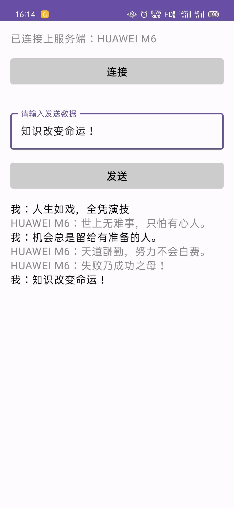

# Android 经典蓝牙开发

### 一、Bluetooth 技术概述

[`<p style="color: #0082FC; font-size: 20px">`Bluetooth®经典 `</p>`](https://www.bluetooth.com/zh-cn/learn-about-bluetooth/tech-overview/)
Bluetooth Classic 无线电，也被称为 Bluetooth 基本速率/增强数据速率（BR/EDR），是一种低功率无线电，在2.4GHz非授权工业、科学和医疗（ISM）频段的79个频道上进行数据流。支持点对点设备通信，Bluetooth Classic 主要用于实现[无线音频流](https://www.bluetooth.com/zh-cn/learn-about-bluetooth/solutions/audio-streaming/)，已成为无线扬声器、耳机和车载娱乐系统背后的标准无线电协议。Bluetooth Classic 无线电还能实现数据传输应用，包括移动打印。

### 二、开启蓝牙

#### 1. 蓝牙权限申请

```xml

<manifest>
    <!-- 使用蓝牙的权限 -->
    <uses-permission android:name="android.permission.BLUETOOTH" />
    <!-- 扫描蓝牙设备或者操作蓝牙设置 -->
    <uses-permission android:name="android.permission.BLUETOOTH_ADMIN" />
    <!-- 与已配对的蓝牙设备通信 -->
    <uses-permission android:name="android.permission.BLUETOOTH_CONNECT" />
    <!-- 查找蓝牙设备 -->
    <uses-permission android:name="android.permission.BLUETOOTH_SCAN" />
    <!--模糊定位权限 -->
    <uses-permission android:name="android.permission.ACCESS_COARSE_LOCATION" />
    <!--精准定位权限 -->
    <uses-permission android:name="android.permission.ACCESS_FINE_LOCATION" />
    <uses-permission android:name="android.permission.ACCESS_BACKGROUND_LOCATION" />
    <!-- 使当前设备可被其他蓝牙设备检测到 -->
    <uses-permission android:name="android.permission.BLUETOOTH_ADVERTISE" />
    <!-- 指明您的应用需要使用传统蓝牙 -->
    <uses-feature android:name="android.hardware.bluetooth" android:required="true" />
</manifest>
```

* **动态检查权限，Android 10 以后还需要开启 GPS，不然不能搜索和连接其他蓝牙设备**

```kotlin
/**
 * 检查权限
 */
fun checkPermissions(activity: Activity): Boolean {
    val permissions = if (Build.VERSION.SDK_INT >= Build.VERSION_CODES.S) {
        arrayOf(
            Manifest.permission.BLUETOOTH_CONNECT,
            Manifest.permission.BLUETOOTH_SCAN,
            Manifest.permission.ACCESS_FINE_LOCATION
        )
    } else {
        arrayOf(
            Manifest.permission.ACCESS_FINE_LOCATION
        )
    }
    val permissionDeniedList: MutableList<String> = ArrayList()
    for (permission in permissions) {
        val permissionCheck = ContextCompat.checkSelfPermission(activity, permission)
        if (permissionCheck != PackageManager.PERMISSION_GRANTED) {
            permissionDeniedList.add(permission)
        }
    }
    if (permissionDeniedList.isNotEmpty()) {
        val deniedPermissions = permissionDeniedList.toTypedArray()
        ActivityCompat.requestPermissions(activity, deniedPermissions, REQUEST_CODE_PERMISSION)
        return false
    }
    // 在 Android 10 还需要开启 gps
    if (Build.VERSION.SDK_INT >= Build.VERSION_CODES.Q) {
        if (!isGpsOpen(activity)) {
            Toast.makeText(activity, "请您先开启gps, 否则蓝牙不可用", Toast.LENGTH_SHORT).show()
            val intent = Intent(Settings.ACTION_LOCATION_SOURCE_SETTINGS)
            activity.startActivityForResult(intent, REQUEST_CODE_OPEN_GPS)
            return false
        }
    }
    return true
}
```

```kotlin
override fun onRequestPermissionsResult(requestCode: Int, permissions: Array<out String>, grantResults: IntArray) {
    super.onRequestPermissionsResult(requestCode, permissions, grantResults)
    ClassicBluetoothManager.onRequestPermissionsResult(this, requestCode, permissions, grantResults)
}
```

```kotlin
/**
 * 权限回调
 * @param requestCode
 * @param permissions
 * @param grantResults
 */
fun onRequestPermissionsResult(
    activity: Activity,
    requestCode: Int,
    permissions: Array<out String?>,
    grantResults: IntArray,
) {
    if (requestCode == REQUEST_CODE_PERMISSION) {
        if (permissions.isNotEmpty()) {
            Toast.makeText(activity, "需要开启权限才能运行应用", Toast.LENGTH_SHORT).show()
            // 构建跳转意图
            val intent = Intent(Settings.ACTION_APPLICATION_DETAILS_SETTINGS)
            val uri = Uri.fromParts("package", activity.packageName, null)
            intent.data = uri
            // 启动权限设置页面
            activity.startActivityForResult(intent, REQUEST_CODE_PERMISSION)
        } else {
            openBlueSync(activity)
        }
    }
}
```

#### 2. 获取 BluetoothAdapter 对象

```kotlin
/** 蓝牙适配器 */
private val mBluetoothAdapter by lazy { BluetoothAdapter.getDefaultAdapter() }
```

#### 3. 判断设备是否支持蓝牙

```kotlin
/**
 * 设备是否支持蓝牙  true为支持
 * @return
 */
fun isSupportBlue(): Boolean {
    return mBluetoothAdapter != null
}
```

#### 4. 判断蓝牙是否开启

```kotlin
/**
 * 蓝牙是否打开   true为打开
 * @return
 */
fun isBlueEnable(): Boolean {
    return isSupportBlue() && mBluetoothAdapter.isEnabled
}
```

#### 5. 开启蓝牙

* **异步自动开启蓝牙**

```kotlin
/**
 * 自动打开蓝牙（异步：蓝牙不会立刻就处于开启状态）
 * 这个方法打开蓝牙不会弹出提示
 */
@SuppressLint("MissingPermission")
fun openBlueAsync(activity: Activity) {
    if (!isBlueEnable() && checkPermissions(activity)) {
        mBluetoothAdapter.enable()
    }
}
```

* **同步提示开启蓝牙**

```kotlin
/**
 * 自动打开蓝牙（同步）
 * 这个方法打开蓝牙会弹出提示
 * 需要在onActivityResult 方法中判断resultCode == RESULT_OK  true为成功
 */
@SuppressLint("MissingPermission")
fun openBlueSync(activity: Activity) {
    if (!isBlueEnable() && checkPermissions(activity)) {
        val intent = Intent(BluetoothAdapter.ACTION_REQUEST_ENABLE)
        activity.startActivityForResult(intent, REQUEST_CODE_OPEN_BLUETOOTH)
    }
}
```

### 三、扫描蓝牙

#### 1. 扫描周围蓝牙设备（配对上的设备有可能扫描不出来）

```kotlin
/**
 * 扫描的方法 返回true 扫描成功
 * 通过接收广播获取扫描到的设备
 * @return
 */
@SuppressLint("MissingPermission")
fun scanBluetooth(): Boolean {
    if (!isBlueEnable()) {
        Log.e(TAG, "Bluetooth not enable!")
        return false
    }

    // 当前是否在扫描，如果是就取消当前的扫描，重新扫描
    cancelScanBluetooth()

    // 此方法是个异步操作，一般搜索12秒
    return mBluetoothAdapter.startDiscovery()
}
```

#### 2. 取消扫描蓝牙

```kotlin
/**
 * 取消扫描蓝牙
 * @return  true 为取消成功
 */
@SuppressLint("MissingPermission")
fun cancelScanBluetooth(): Boolean {
    return if (isSupportBlue() && mBluetoothAdapter.isDiscovering) {
        mBluetoothAdapter.cancelDiscovery()
    } else {
        true
    }
}
```

#### 3. 通过动态注册广播的方式接收扫描结果

```kotlin
fun registerBluetoothScanBroadcastReceiver(
    context: Context,
    lifecycleOwner: LifecycleOwner,
    onScanStarted: () -> Unit = {},
    onScanning: (BluetoothDevice?) -> Unit,
    onScanFinished: () -> Unit = {},
) = apply {
    val receiver = BluetoothScanBroadcastReceiver(onScanStarted, onScanning, onScanFinished)
    val lifecycleObserver = object : DefaultLifecycleObserver {
        override fun onStart(owner: LifecycleOwner) {
            IntentFilter().apply {
                addAction(BluetoothDevice.ACTION_FOUND)
                addAction(BluetoothAdapter.ACTION_DISCOVERY_STARTED)
                addAction(BluetoothAdapter.ACTION_DISCOVERY_FINISHED)
            }.also {
                context.registerReceiver(receiver, it)
            }
        }

        override fun onStop(owner: LifecycleOwner) {
            context.unregisterReceiver(receiver)
        }

        override fun onDestroy(owner: LifecycleOwner) {
            lifecycleOwner.lifecycle.removeObserver(this)
        }
    }

    lifecycleOwner.lifecycle.addObserver(lifecycleObserver)
}
```

```kotlin
class BluetoothScanBroadcastReceiver(
    val onScanStarted: () -> Unit = {},
    val onScanning: (BluetoothDevice?) -> Unit = {},
    val onScanFinished: () -> Unit = {},
) : BroadcastReceiver() {
    override fun onReceive(context: Context?, intent: Intent?) {
        when (intent?.action) {
            BluetoothAdapter.ACTION_DISCOVERY_STARTED -> {
                Log.d("BluetoothScan", "开始扫描...")
                onScanStarted()
            }

            BluetoothAdapter.ACTION_DISCOVERY_FINISHED -> {
                Log.d("BluetoothScan", "结束扫描...")
                onScanFinished()
            }

            BluetoothDevice.ACTION_FOUND -> {
                Log.d("BluetoothScan", "发现设备...")
                val device: BluetoothDevice? = intent.getParcelableExtra(BluetoothDevice.EXTRA_DEVICE)
                onScanning(device)
            }
        }
    }
}
```

### 四、蓝牙配对

#### 1. 开始配对

```kotlin
/**
 * 配对（配对成功与失败通过广播返回）
 * @param device
 */
@SuppressLint("MissingPermission")
fun bondBluetooth(device: BluetoothDevice?) {
    if (device == null) {
        Log.e(TAG, "bond device null")
        return
    }
    if (!isBlueEnable()) {
        Log.e(TAG, "Bluetooth not enable!")
        return
    }
    // 配对之前把扫描关闭
    cancelScanBluetooth()

    // 判断设备是否配对，没有配对再配，配对了就不需要配了
    if (device.bondState == BluetoothDevice.BOND_NONE) {
        Log.d(TAG, "attempt to bond:" + device.name)
        runCatching {
            val createBondMethod = device.javaClass.getMethod("createBond")
            createBondMethod.invoke(device)
        }.onFailure {
            it.printStackTrace()
            Log.e(TAG, "attempt to bond fail!")
        }
    }
}
```

#### 2. 取消配对

```kotlin
/**
 * 取消配对（取消配对成功与失败通过广播返回 也就是配对失败）
 * @param device
 */
@SuppressLint("MissingPermission")
fun cancelBondBluetooth(device: BluetoothDevice?) {
    if (device == null) {
        Log.d(TAG, "cancel bond device null")
        return
    }
    if (!isBlueEnable()) {
        Log.e(TAG, "Bluetooth not enable!")
        return
    }
    //判断设备是否配对，没有配对就不用取消了
    if (device.bondState != BluetoothDevice.BOND_NONE) {
        Log.d(TAG, "attempt to cancel bond:" + device.name)
        runCatching {
            val removeBondMethod = device.javaClass.getMethod("removeBond")
            removeBondMethod.invoke(device)
        }.onFailure {
            it.printStackTrace()
            Log.e(TAG, "attempt to cancel bond fail!")
        }
    }
}
```

#### 3. 通过动态注册广播的方式接收配对结果

```kotlin
fun registerBluetoothBondBroadcastReceiver(
    context: Context,
    lifecycleOwner: LifecycleOwner,
    onBondRequest: () -> Unit = {},
    onBondFail: () -> Unit = {},
    onBonding: (BluetoothDevice?) -> Unit = {},
    onBondSuccess: (BluetoothDevice?) -> Unit = {},
) = apply {
    val receiver = BluetoothBondBroadcastReceiver(onBondRequest, onBondFail, onBonding, onBondSuccess)
    val lifecycleObserver = object : DefaultLifecycleObserver {
        override fun onStart(owner: LifecycleOwner) {
            IntentFilter().apply {
                addAction(BluetoothDevice.ACTION_PAIRING_REQUEST)
                addAction(BluetoothDevice.ACTION_BOND_STATE_CHANGED)
            }.also {
                context.registerReceiver(receiver, it)
            }
        }

        override fun onStop(owner: LifecycleOwner) {
            context.unregisterReceiver(receiver)
        }

        override fun onDestroy(owner: LifecycleOwner) {
            lifecycleOwner.lifecycle.removeObserver(this)
        }
    }

    lifecycleOwner.lifecycle.addObserver(lifecycleObserver)
}
```

```kotlin
class BluetoothBondBroadcastReceiver(
    val onBondRequest: () -> Unit = {},
    val onBondFail: () -> Unit = {},
    val onBonding: (BluetoothDevice?) -> Unit = {},
    val onBondSuccess: (BluetoothDevice?) -> Unit = {},
) : BroadcastReceiver() {
    // 此处为你要连接的蓝牙设备的初始密钥，一般为1234或0000
    private val pin = "0000"

    @SuppressLint("MissingPermission")
    override fun onReceive(context: Context?, intent: Intent?) {
        val device: BluetoothDevice? = intent?.getParcelableExtra(BluetoothDevice.EXTRA_DEVICE)
        when (intent?.action) {
            BluetoothDevice.ACTION_PAIRING_REQUEST -> {
                runCatching {
                    onBondRequest()
                    // 1.确认配对
                    val setPairingConfirmation = device?.javaClass?.getDeclaredMethod(
                        "setPairingConfirmation",
                        Boolean::class.javaPrimitiveType,
                    )
                    setPairingConfirmation?.invoke(device, true)
                    // 2.终止有序广播
                    Log.d(
                        "order...",
                        "isOrderedBroadcast:$isOrderedBroadcast, isInitialStickyBroadcast:$isInitialStickyBroadcast"
                    )
                    // 如果没有将广播终止，则会出现一个一闪而过的配对框。
                    abortBroadcast()

                    // 3.调用setPin方法进行配对...
                    val removeBondMethod = device?.javaClass?.getDeclaredMethod("setPin", ByteArray::class.java)
                    removeBondMethod?.invoke(device, arrayOf<Any>(pin.toByte()))
                }.onFailure {
                    it.printStackTrace()
                }
            }

            BluetoothDevice.ACTION_BOND_STATE_CHANGED -> {
                when (device?.bondState) {
                    BluetoothDevice.BOND_NONE -> {
                        Log.d("BluetoothBond", "取消配对")
                        onBondFail()
                    }

                    BluetoothDevice.BOND_BONDING -> {
                        Log.d("BluetoothBond", "配对中")
                        onBonding(device)
                    }

                    BluetoothDevice.BOND_BONDED -> {
                        Log.d("BluetoothBond", "配对成功")
                        onBondSuccess(device)
                    }
                }
            }
        }
    }
}
```

#### 4. 获取已经配对的设备

```kotlin
/**
 * 获取已经配对的设备
 */
@SuppressLint("MissingPermission")
fun getBondedDevices(): List<BluetoothDevice>? {
    return mBluetoothAdapter.bondedDevices?.toList()
}
```

### 五、经典蓝牙聊天室

客户端 | 服务端
--- | ---
 | 

#### 1. [作为服务器连接](https://developer.android.google.cn/develop/connectivity/bluetooth/connect-bluetooth-devices?hl=zh-cn#connect-server)

> 当两台设备连接时，其中一台充当服务端，它会监听是否有客户端接入，通过以下步骤创建服务端：

1. 通过调用 [`listenUsingRfcommWithServiceRecord(String, UUID)`](https://developer.android.google.cn/reference/android/bluetooth/BluetoothAdapter?hl=zh-cn#listenUsingRfcommWithServiceRecord(java.lang.String,%20java.util.UUID)) 获取 `BluetoothServerSocket`。

   该字符串是您的服务的可识别名称，系统会自动将其写入设备上的新服务发现协议 (SDP) 数据库条目。该名称可以任意设置，可以直接使用应用名称。 通用唯一标识符 (UUID) 也包含在 SDP 条目中，并且构成了与客户端设备连接协议的基础。也就是说，当客户端尝试与此设备连接时，它会携带 UUID，该 UUID 可唯一标识其想要连接的服务。这两个 **UUID 必须匹配，系统才会接受连接**。

   UUID 是用于唯一标识信息的字符串 ID 的 128 位标准化格式。UUID 用于标识在系统或网络中需要具有唯一性的信息，因为 UUID 重复的概率实际上为零。它可以独立生成，无需使用集中式授权机构。在这种情况下，它用于唯一标识应用的蓝牙服务。如需获取用于您的应用的 UUID，您可以使用网络上的众多随机 [`UUID`](https://developer.android.google.cn/reference/java/util/UUID?hl=zh-cn) 生成器之一，然后使用 [`fromString(String)`](https://developer.android.google.cn/reference/java/util/UUID?hl=zh-cn#fromString(java.lang.String)) 初始化该 UUID。
   `<br>`
2. 通过调用 [`accept()`](https://developer.android.google.cn/reference/android/bluetooth/BluetoothServerSocket?hl=zh-cn#accept()) 开始监听连接请求。

   这是阻塞调用。它会在连接被接受或发生异常时返回。仅当远程设备发送的连接请求中包含的 UUID 与使用此监听服务器套接字注册的 UUID 相匹配时，系统才会接受连接。如果操作成功，`accept()` 会返回一个已连接的 `BluetoothSocket`。
   `<br>`
3. 除非您想接受其他连接，否则请调用 [`close()`](https://developer.android.google.cn/reference/android/bluetooth/BluetoothServerSocket?hl=zh-cn#close())。

   此方法调用会释放服务器套接字及其所有资源，但**不会关闭 `accept()` 返回的已连接 `BluetoothSocket`**。与 TCP/IP 不同，RFCOMM 一次只允许每个通道有一个已连接的客户端，因此在大多数情况下，在接受已连接的套接字后立即在 `BluetoothServerSocket` 上调用 `close()` 是合理的。
   `<br>`

以下是接受传入连接的服务器组件的简化线程：

```kotlin
/**
 * 连接蓝牙设备--服务端
 * @param uuid 需与 [ConnectThread] 中的 uuid 一致
 */
@SuppressLint("MissingPermission")
class AcceptThread(
    private val uuid: UUID,
    private val secure: Boolean = true,
    private val onBluetoothListener: OnBluetoothListener? = null,
) : Thread() {
    private val mBluetoothAdapter by lazy { BluetoothAdapter.getDefaultAdapter() }
    private val mBluetoothServerSocket by lazy {
        onBluetoothListener?.onReadyConnect()
        if (secure) {
            mBluetoothAdapter?.listenUsingRfcommWithServiceRecord("ServerSocket", uuid)
        } else {
            mBluetoothAdapter?.listenUsingInsecureRfcommWithServiceRecord("ServerSocket", uuid)
        }
    }
    private var mClassicBluetoothMessageHandler: ClassicBluetoothMessageHandler? = null
    private var mCanLoop = true

    override fun run() {
        super.run()
        while (mCanLoop) {
            val bluetoothSocket = runCatching {
                // 监听是否有客户端接入
                mBluetoothServerSocket?.accept()
            }.onFailure {
                it.printStackTrace()
                mCanLoop = false
            }.getOrNull()
            // 获取客户端设备
            val remoteBluetoothDevice = bluetoothSocket?.remoteDevice
            remoteBluetoothDevice?.let {
                // 连接成功
                onBluetoothListener?.onConnected(it)
                mClassicBluetoothMessageHandler = ClassicBluetoothMessageHandler(
                    bluetoothSocket = bluetoothSocket,
                    onBluetoothListener = onBluetoothListener,
                )
                // 关闭服务端，只连接一个
                runCatching {
                    mBluetoothServerSocket?.close()
                }.onFailure {
                    it.printStackTrace()
                }
                mCanLoop = false
            }
        }
    }

    fun sendMsg(msg: String) {
        mClassicBluetoothMessageHandler?.sendMsg(msg)
    }

    fun cancel() {
        runCatching {
            mBluetoothServerSocket?.close()
        }.onFailure {
            it.printStackTrace()
        }
        mClassicBluetoothMessageHandler?.cancel()
    }
}
```

#### 2. [作为客户端连接](https://developer.android.google.cn/develop/connectivity/bluetooth/connect-bluetooth-devices?hl=zh-cn#connect-client)

> 发起与在开放式服务器套接字上接受连接的远程设备的连接，必须先获取一个表示该远程设备的 `BluetoothDevice` 对象。然后，您必须使用 `BluetoothDevice` 获取 `BluetoothSocket` 并发起连接。

基本步骤如下所示：

1. 使用 `BluetoothDevice`，通过调用 [`createRfcommSocketToServiceRecord(UUID)`](https://developer.android.google.cn/reference/android/bluetooth/BluetoothDevice?hl=zh-cn#createRfcommSocketToServiceRecord(java.util.UUID)) 获取 `BluetoothSocket`。

   此方法会初始化允许客户端连接到 `BluetoothDevice` 的 `BluetoothSocket` 对象。此处传递的 UUID 必须与服务器设备在调用 [`listenUsingRfcommWithServiceRecord(String, UUID)`](https://developer.android.google.cn/reference/android/bluetooth/BluetoothAdapter?hl=zh-cn#listenUsingRfcommWithServiceRecord(java.lang.String,%20java.util.UUID)) 以打开其 `BluetoothServerSocket` 时使用的 UUID 相匹配。如要使用匹配的 UUID，请将 UUID 字符串硬编码到您的应用中，然后通过服务器代码和客户端代码引用该字符串。
   `<br>`
2. 通过调用 `connect()` 发起连接。请注意，此方法为阻塞调用。

   在客户端调用此方法后，系统会执行 SDP 查找，以查找具有匹配 UUID 的远程设备。如果查找成功并且远程设备接受连接，则会共享 RFCOMM 通道以便在连接期间使用，并且 `connect()` 方法会返回。如果连接失败，或者 `connect()` 方法超时（大约 12 秒后），该方法会抛出 [`IOException`](https://developer.android.google.cn/reference/java/io/IOException?hl=zh-cn)。
   `<br>`

以下是发起蓝牙连接的客户端线程的基本示例：

```kotlin
/**
 * 连接蓝牙设备--客户端
 * @param uuid 需与 [AcceptThread] 中的 uuid 一致
 */
@SuppressLint("MissingPermission")
class ConnectThread(
    private val bluetoothDevice: BluetoothDevice?,
    private val uuid: UUID,
    private val secure: Boolean = true,
    private val onBluetoothListener: OnBluetoothListener?,
) : Thread() {
    private val mBluetoothAdapter by lazy { BluetoothAdapter.getDefaultAdapter() }
    private val mBluetoothSocket by lazy {
        onBluetoothListener?.onReadyConnect()
        // 监听该 uuid
        if (secure) {
            bluetoothDevice?.createRfcommSocketToServiceRecord(uuid)
        } else {
            bluetoothDevice?.createInsecureRfcommSocketToServiceRecord(uuid)
        }
    }
    private var mClassicBluetoothMessageHandler: ClassicBluetoothMessageHandler? = null

    override fun run() {
        super.run()
        // 先取消扫描
        mBluetoothAdapter?.cancelDiscovery()
        runCatching {
            // connect() 方法为阻塞调用
            mBluetoothSocket?.connect()
            // 连接成功，获取服务端设备
            val remoteBluetoothDevice = mBluetoothSocket?.remoteDevice
            onBluetoothListener?.onConnected(remoteBluetoothDevice)
            // 初始化蓝牙数据传输处理器
            mClassicBluetoothMessageHandler = ClassicBluetoothMessageHandler(
                bluetoothSocket = mBluetoothSocket,
                onBluetoothListener = onBluetoothListener
            )
        }.onFailure {
            it.printStackTrace()
            onBluetoothListener?.onFailed(it.message)
        }
    }

    fun sendMsg(msg: String) {
        mClassicBluetoothMessageHandler?.sendMsg(msg)
    }

    fun cancel() {
        mClassicBluetoothMessageHandler?.cancel()
    }
}
```

#### 3. 套接字读写

> 不管是服务端还是客户端都用到 `ClassicBluetoothMessageHandler` 来处理套接字读写的问题。
>
> 首先，可以通过 BluetoothSocket 的 使用 **getInputStream()** 和  **getOutputStream()** ，分别获取通过套接字处理数据传输的 InputStream 和 OutputStream。
> 接着使用 **read(byte[])** 和 **write(byte[])** 读取数据以及将其写入数据流。

```kotlin
/**
 * 经典蓝牙 BluetoothSocket 消息处理器
 */
class ClassicBluetoothMessageHandler(
    private val bluetoothSocket: BluetoothSocket?,
    private val onBluetoothListener: OnBluetoothListener?,
) {

    private val mReceiveMessageThread by lazy { ReceiveMessageThread(bluetoothSocket, onBluetoothListener) }
    private val mSendMessageImpl by lazy { SendMessageImpl(bluetoothSocket, onBluetoothListener) }

    init {
        mReceiveMessageThread.start()
    }

    fun sendMsg(msg: String) {
        mSendMessageImpl.sendMsg(msg)
    }

    fun cancel() {
        mReceiveMessageThread.cancel()
        mSendMessageImpl.cancel()
    }

    /**
     * 接收消息
     */
    internal class ReceiveMessageThread(
        private val bluetoothSocket: BluetoothSocket?,
        private val onBluetoothListener: OnBluetoothListener?,
    ) : Thread() {
        private val mBufferedInputStream = BufferedInputStream(bluetoothSocket?.inputStream)
        private val mByteArray = ByteArray(1024)
        private var mEnable = true

        override fun run() {
            super.run()
            var size = 0
            while (mEnable) {
                runCatching {
                    size = mBufferedInputStream.read(mByteArray)
                }.onFailure {
                    it.printStackTrace()
                    mEnable = false
                    onBluetoothListener?.onFailed(it.message)
                }
                if (size > 0) {
                    onBluetoothListener?.onReceiveMsg(bluetoothSocket?.remoteDevice, String(mByteArray, 0, size))
                } else {
                    onBluetoothListener?.onFailed("断开连接")
                    mEnable = false
                }
            }
        }

        fun cancel() {
            mEnable = false
            runCatching {
                bluetoothSocket?.close()
            }.onFailure {
                it.printStackTrace()
            }
            runCatching {
                mBufferedInputStream.close()
            }.onFailure {
                it.printStackTrace()
            }
        }
    }

    /**
     * 发送消息
     */
    internal class SendMessageImpl(
        private val bluetoothSocket: BluetoothSocket?,
        private val onBluetoothListener: OnBluetoothListener?,
    ) {
        private val mOutputStream = bluetoothSocket?.outputStream

        fun sendMsg(msg: String) {
            CoroutineScope(Dispatchers.IO).launch {
                var errorMsg: String? = null
                val result = runCatching {
                    mOutputStream?.write(msg.toByteArray())
                    mOutputStream?.flush()
                    true
                }.onFailure {
                    it.printStackTrace()
                    errorMsg = it.message
                }.getOrElse { false }
                if (result) {
                    onBluetoothListener?.onSendMsg(msg)
                } else {
                    onBluetoothListener?.onFailed(errorMsg)
                }
            }
        }

        fun cancel() {
            runCatching {
                bluetoothSocket?.close()
            }.onFailure {
                it.printStackTrace()
            }
            runCatching {
                mOutputStream?.close()
            }.onFailure {
                it.printStackTrace()
            }
        }
    }
}

interface OnBluetoothListener {
    fun onReadyConnect() {}
    fun onConnected(bluetoothDevice: BluetoothDevice?) {}
    fun onSendMsg(msg: String?) {}
    fun onReceiveMsg(bluetoothDevice: BluetoothDevice?, msg: String?) {}
    fun onFailed(errorMsg: String?) {}
}
```
