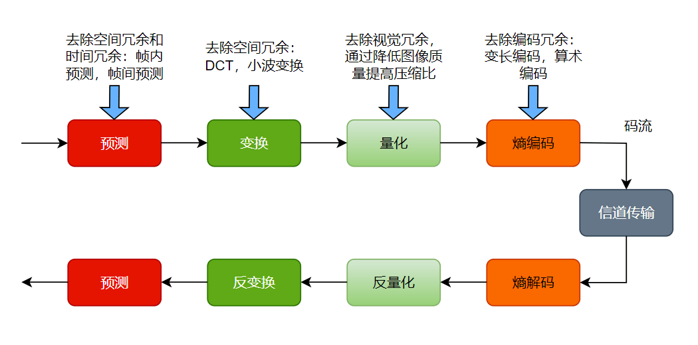

# 音视频编解码原理

编码解码技术的基本原理涵盖了数字信号、声音信号、图像信号以及视频信号等多个方面。

* **数字信号**
  * 数字信号编码的基本原理是采样和量化。首先，将连续信号离散化成一个一个的采样点，然后用量化器将每个采样点映射成对应的离散值。在此基础上，可以使用多种编码方式，例如差分编码、霍夫曼编码和算术编码等。
* **声音信号**
  * 声音信号编码的基本原理是通过将模拟声音信号转换成数字信号进行编码。声音信号编码包含了模拟信号的采样和量化，以及数字信号的编码和压缩。常见的声音编码方式包括脉冲编码调制（PCM）和自适应差分脉冲编码（ADPCM）等。
* **图像信号**
  * 图像信号编码的基本原理是通过采样、量化和编码将图像信号转换成数字信号。在图像信号编码中，常用的压缩算法包括 JPEG、GIF 和
    PNG 等。
* **视频信号**
  * 视频信号编码的基本原理是通过将视频信号分解成一系列的图像帧，并将这些图像帧编码成数字信号。视频编码通常采用先压缩再编码的方法，即先对每一帧图像进行压缩处理，然后对压缩后的数据进行编码。常见的视频编码方式包括 H.264、H.265 和 VP9 等。
  * 值得一提的是，华为公司提出的全新的视频编码技术——华为 5G 编码技术（H.266/VVC），该技术通过多种先进的算法，能够在保证视频质量的前提下，将视频数据压缩至更小的尺寸，从而有效提高了网络传输效率。

### 一、音频编码

1. 自然界中的声音非常复杂，波形极其复杂，通常我们采用的是脉冲代码调制编码，即 PCM 编码。PCM 通过抽样、量化、编码三个步骤将连续变化的模拟信号转换为数字编码。
2. 将音频采样数据(PCM 等)压缩成音频码流,从而降低音频的数据量。音频编码也是互联网视音频技术中的一个重要技术，高效率的音频在同等码率下,可以获得更好的音质。
3. 常见的音频编码格式有 AAC、MP3、AC3。

* **MP3**：是一种音频压缩技术，它被设计用来大幅度地降低音频数据量。将音乐以 1:10 甚至 1:12 的压缩率，压缩成容量较小的文件，而对于大多数的用户来说，重放的音质与最初不压缩的音频相比没有明显下降。 MP3 的特点是，利用人耳对高频信号不敏感的特性，将时域波形信号转换成频域信号，并划分成多个频段，对不同的频段使用不同的压缩率，对高频信号使用大压缩率（甚至忽略信号），对低频信号使用小压缩率，保证信号不失真。这样一来就相当于抛弃人耳基本听不到的高频声音，只保留能听到的低频部分，从而将声音用 1:10 甚至 1:12 的压缩率压缩。（注：音频分成多段，高频大压缩率，低频小压缩率）
* **AAC**：一种专门为声音数据设计的文件压缩格式，与 MP3 不同，它采用了全新的算法进行编码，更加高效，具有更高的“性价比”，在感觉声音在没有明显降低的前提下，可使文件更加小巧。AAC 的优点是，相对于 MP3，AAC 的音质更佳文件更小。AAC 缺点是，AAC 是属于有损压缩格式，与时下流行的 APE、FLAC 等无损压缩格式相比音质存在本质上的差距。（注：比 MP3 更好的音质更小的文件，但是有损音质）
* **AC3**：有损音频编码格式。被广泛应用与 5.1 声道。AC3 普及程度很高，唱片、电影院。AC3 提供的环绕声系统由 5 个全频域声道和 1 个超低音声道组成。（注：立体音效，但是有损音质）

### 二、视频编码

1. 视频编码的主要作用是将视频像素数据（RGB，YUV等）压缩成为视频码流，从而降低视频的数据量。如果视频不经过压缩编码的话，体积通常是非常大的，一部电影可能就要上百G的空间。视频编码是视音频技术中最重要的技术之一。视频码流的数据量占了视音频总数据量的绝大部分。高效率的视频编码在同等的码率下，可以获得更高的视频质量。
2. 在视频编解码技术定义方面有两大标准机构。一个是国际电信联盟 (ITU) 针对多媒体通信制定的H.26x系列视频编码标准和G.7系列音频编码标准。其中包括 H.261、H.262、H.263 与 H.264；另一个是国际标准化组织 (ISO) 主要针对消费类应用，已经针对运动图像压缩定义了 MPEG 标准。MPEG 标准包括 MPEG1、MPEG2 与 MPEG4。1994年由MPEG和ITU合作制定的MPEG-2是第一代音视频编解码标准的代表，也是目前国际上最为通行的音视频标准。

### 三、解码

1. 就是将视频/音频压缩编码数据,解码成为非压缩的视频/音频原始数据。音频的压缩编码标准包含AAC, MP3, AC-3等等,视频的压缩编码标准则包含H.264, MPEG2, VC-1等等解码是整个系统中最重要也是最复杂的一个环节.通过解码,压缩编码的视频数据输出成为非压缩的颜色数据,例如: YUV420P, RGB等等压缩编码的音频数据输出成为非压缩的音频抽样数据,例如: PCM数据。
2. 解码：H.264 原始码流–>NALU
   * **I帧**: 保留了一张完整视频帧，解码关键!
   * **P帧**: 先前参考帧，差异数据，解码需要依赖于I帧。
   * **B帧**: 双向参考帧，解码时既需要I帧，也需要P帧!
   * 如果 H.264 码流中I帧错误/丢失，就会导致错误传递，P/B帧单独是完成不了解码工作!

### 四、编解码关键

* **预测**：通过帧内预测和帧间预测降低视频图像的空间冗余和时间冗余。
* **变换**：通过从时域到频域的变换，去除相邻数据之间的相关性，即去除空间冗余。
* **量化**：通过用更粗糙的数据表示精细的数据来降低编码的数据量，或者通过去除人眼不敏感的信息来降低编码数据量。
* **扫描**：将二维变换量化数据重新组织成一维的数据序列。
* **熵编码**：根据待编码数据的概率特性减少编码冗余。

**原始视频压缩的目的是去除冗余信息，可以去除的冗余包括：**

* `空间冗余`：图像相邻像素之间有较强的相关性
* `时间冗余`：视频序列的相邻图像之间内容相似
* `编码冗余`：不同像素值出现的概率不同
* `视觉冗余`：人的视觉系统对某些细节不敏感
* `知识冗余`：规律性的结构可由先验知识和背景知识得到

### 五、码率

1. 码率就是失真度，码率越高越清晰，反之则画面粗糙而多马赛克。
2. 数据传输时单位时间传送的数据位数，一般我们用的单位是 kbps 即千位每秒。
3. 通俗一点的理解就是取样率，单位时间内取样率越大，精度就越高，处理出来的文件就越接近原始文件，但是文件体积与取样率是成正比的，所以几乎所有的编码格式重视的都是如何用最低的码率达到最少的失真，围绕这个核心衍生出来的cbr（固定码率）与vbr（可变码率），都是在这方面做的文章，不过事情总不是绝对的，举例来看，对于一个音频，其码率越高，被压缩的比例越小，音质损失越小，与音源的音质越接近。
4. **码率计算公式**：`码率(kbps)= 文件大小(KB) * 8 / 时间(秒) `。
   举例：D5碟，容量4.3G，其中考虑到音频的不同格式，算为600M，（故剩余容量为4.3*1024-600=3803.2M)，所以视频文件应不大于3.7G，本例中取视频文件的容量为3.446G，视频长度100分钟（6000秒）。
   计算结果：码率约等于4818kbps(3.446 * 1024 * 1024 * 8 / 6000 = 4817.857)。
5. **几点原则**：
   * 码率和质量成正比，但是文件体积也和码率成正比。这是要牢记的;
   * 码率超过一定数值，对图像的质量没有多大影响;
   * 如果是1M的宽带，在网上只能看不超过1024kbps的视频，超过1024kbps的视频只能等视频缓冲才能顺利观看。

### 六、帧率

1. 帧率是指每秒钟刷新的图片的帧数，也可以理解为图形处理器每秒钟能够刷新几次。越高的帧速率可以得到更流畅、更逼真的动画。每秒钟帧数(FPS)越多，所显示的动作就会越流畅。
2. 由于人类眼睛的特殊生理结构，如果所看画面之帧率高于16的时候，就会认为是连贯的，此现象称之为视觉停留。这也就是为什么电影胶片是一格一格拍摄出来，然后快速播放的。
3. 每秒的帧数(fps)或者说帧率表示图形处理器处理场时每秒钟能够更新的次数。高的帧率可以得到更流畅、更逼真的动画。一般来说30fps就是可以接受的，但是将性能提升至60fps则可以明显提升交互感和逼真感，但是一般来说超过75fps一般就不容易察觉到有明显的流畅度提升了。如果帧率超过屏幕刷新率只会浪费图形处理的能力，因为监视器不能以这么快的速度更新，这样超过刷新率的帧率就浪费掉了。

### 七、常见的编码方式

1. **H.26X 系列**，由国际电传视讯联盟远程通信标准化组织(ITU-T)主导。
   * H.261，主要用于老的视频会议和视频电话系统。是第一个使用的数字视频压缩标准。实质上说，之后的所有的标准视频编解码器都是基于它设计的。
   * H.262，等同于 MPEG-2 第二部分，使用在 DVD、SVCD 和大多数数字视频广播系统和有线分布系统中。
   * H.263，主要用于视频会议、视频电话和网络视频相关产品。在对逐行扫描的视频源进行压缩的方面，H.263 比它之前的视频编码标准在性能上有了较大的提升，尤其是在低码率端，它可以在保证一定质量的前提下大大的节约码率。
   * H.264，等同于 MPEG-4 第十部分，也被称为高级视频编码(Advanced Video Coding，简称 AVC)，是一种视频压缩标准，一种被广泛使用的高精度视频的录制、压缩和发布格式。该标准引入了一系列新的能够大大提高压缩性能的技术，并能够同时在高码率端和低码率端大大超越以前的诸标准。
   * H.265，被称为高效率视频编码(High Efficiency Video Coding，简称 HEVC)是一种视频压缩标准，是 H.264 的继任者。HEVC 被认为不仅提升图像质量，同时也能达到 H.264 两倍的压缩率（等同于同样画面质量下比特率减少了 50%），可支持 4K 分辨率甚至到超高画质电视，最高分辨率可达到 8192×4320（8K 分辨率），这是目前发展的趋势。
2. **H.264**，压缩能力比H.263更强。高压缩比、高图像质量、良好的网络适应性，在较低带宽上提供高质量的图像传输。是为新一代交互视频通讯制定的标准。该标准也被称为AVC(Advanced Video Coding)标准，是MPEG-4的第10部分。
3. **H.265**，是继H.264之后所制定的新的视频编码标准。新技术H.265旨在有限带宽下传输更高质量的网络视频，仅需原先的一半带宽即可播放相同质量的视频。这也意味着，我们的智能手机、平板机等移动设备将能够直接在线播放1080p的全高清视频。H.265标准也同时支持4K(4096×2160)和8K(8192×4320)超高清视频。
4. **H.264 和 H.265 的区别**
   * H.265标准围绕着现有的视频编码标准H.264，保留原来的某些技术，同时对一些相关的技术加以改进，h265相较于h264使用先进的技术用以改善码流、编码质量、延时和算法复杂度之间的关系，达到最优化设置。压缩率：在同样的图像质量下，相比于h264，通过h265编码的视频大小减少了大约40%。传输码率：h264可以在低于2兆每秒的速度下实现标清数字图像传送。而h265则可以在低于1.5兆每秒的速度下实现全高清视频的传输。运算需求：由于h265比较h264压缩率更高，编码视频更小，所以对机器的运算需求也要更大。
5. **MPEG 系列**，由国际标准组织机构(ISO)下属的运动图象专家组(MPEG)开发。
   * MPEG-1 第二部分，主要使用在 VCD 上，有些在线视频也使用这种格式。该编解码器的质量大致上和原有的 VHS 录像带相当。
   * MPEG-2 第二部分，等同于 H.262，使用在 DVD、SVCD 和大多数数字视频广播系统和有线分布系统中。
   * MPEG-4 第二部分，可以使用在网络传输、广播和媒体存储上。比起 MPEG-2 第二部分和第一版的 H.263，它的压缩性能有所提高。
   * MPEG-4 第十部分，等同于 H.264，是这两个编码组织合作诞生的标准。
   * 其他，AMV、AVS、Bink、CineForm 等等，这里就不做多的介绍了。

### 八、直播

视频内容是实时录制的，与此同时，将音视频以媒体“流”的形式推到服务器上。此时，一旦有观众收看该直播，服务器收到响应后，会将媒体流传输至播放器，实现视频播放，客户端通过支持流媒体协议的播放器实时播放同样的内容，不可拖动进度。

**直播一般流程**：

1. 音视频采集
2. 视频滤镜
3. 音视频编码
4. 推流
5. 流媒体服务器处理
6. 拉流
7. 音视频解码
8. 音视频播放

### 九、点播

* 视频点播是二十世纪90年代在国外发展起来的，英文称为“Video on Demand”，所以也称为“VOD”。顾名思义，就是根据观众的要求播放节目的视频点播系统，把用户所点击或选择的视频内容，传输给所请求的用户。视频点播业务是近年来新兴的传媒方式，是计算机技术、网络通信技术、多媒体技术、电视技术和数字压缩技术等多领域融合的产物
* 视频内容已经存放在服务器上（换句话说，我们能够得到该视频文件在服务器上的URL地址），我们可以选择性地播放某个“大片”，服务端存放多个视频文件，客户端可通过网路点播客户端任意观看其中一个视频，并可拖动进度进行观看。
* **与直播区别**：相同点都是在服务器上存放视频数据，区别是直播是实时录制，并传输到服务器，通过流媒体实时播放，点播则是服务器提前存放视频文件，用户选择内容，服务器传输相应内容，进行播放。

### 十、视频播放器原理

> **播放器播放流程：**
> 视频文件，步骤：解协议，解封装，解码视音频，音视频同步。
> 本地文件，步骤：解封装，解码视音频，视音频同步。

* **解协议** ：将Http等流媒体协议传输的文件解析为标准的封装格式数据。如将RTMP协议传输的数据，经过解析操作后输出为FLV格式的数据。
* **解封装** （解复用）：将输入的封装格式的数据，分离为音频流压缩编码数据和视频流压缩编码数据，即： **分离信道** 。
* **解码** ：将视频/音频压缩编码数据，解码成为非压缩的视频/音频原始数据。通过解码，压缩编码的视频数据输出成为非压缩的颜色数据，例如YUV420P，RGB等等；压缩编码的音频数据输出成为非压缩的音频抽样数据，例如PCM数据。
* **音视频同步** ：根据解封装模块处理过程中获取到的参数信息，同步解码出来的视频和音频数据，并将视频音频数据送至系统的显卡和声卡播放出来。
